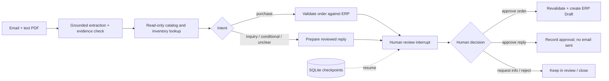

# B2B Email Order Review Lab

An open-source, consulting-oriented IT engineering portfolio: a bounded B2B email-to-ERP workflow that demonstrates how business requirements become traceable, human-controlled software using TypeScript, LangChain, LangGraph, LangSmith, SQLite, and ERPNext-compatible APIs.

All examples and fixture records are fictional. The project deliberately has no vector database or multi-agent workflow. Every live model path uses only `gemini-2.5-flash-lite` through the shared entry point in `src/model.ts`; deterministic tests make no model calls.

## What this project is

This project uses a fictional order-review process to demonstrate consulting-relevant engineering judgment: defining scope, preserving evidence, constraining model and tool authority, and making review and recovery observable. It is not a production spam filter, a general inbox security product, or a fully autonomous order agent.

It demonstrates:

- email and text-PDF intake through the CLI and learning lab;
- grounded extraction with source evidence;
- read-only catalog candidate retrieval ranked by matched terms, with human confirmation for fuzzy descriptions;
- read-only ERP lookups for customer, catalog, address, inventory, and pricing;
- LangGraph interrupts, persisted checkpoints, and review/replay recovery;
- deterministic validation before order writes;
- human approval boundaries before ERP Draft writes;
- explicit audit, reconciliation, and benchmark reporting on fictional data.

## Flow



## Scope and non-goals

The benchmark here is workflow correctness, evidence traceability, and operational boundaries, not spam classification coverage. The current application does not include an inbound webhook service or durable queue.

This project intentionally does not claim:

- universal junk-email detection;
- production-grade inbox security;
- model autonomy over ERP writes;
- zero false positives or zero false negatives in real-world mail traffic.

The workflow validates extracted evidence and order constraints, then requires human review before an ERP Draft write. It does not claim to classify spam or provide inbox security; suspicious or irrelevant mail handling is outside the current implementation.

## Fast start

```powershell
npm ci
npm run check
npm test
npm run learn
```

Then open http://127.0.0.1:3210 for the local learning UI. See [docs/learning-guide.md](docs/learning-guide.md) for the Chinese-first walkthrough.

## Evidence and benchmarks

Current evidence is explicitly bounded and fictional:

- local ERPNext-compatible mock runs for human-approved Draft creation and duplicate checks;
- a LangSmith trace exists for one fictional inquiry flow with extraction, read-only inventory tools, grounded drafting, and interrupt-based review;
- deterministic benchmarks and gold fixtures are kept separate from live model output;
- all unverified claims remain labeled as such in the docs and verification notes.

See [docs/verification.md](docs/verification.md), [docs/evaluation.md](docs/evaluation.md), and [docs/model.md](docs/model.md) for the precise boundaries.

## Quick start

Requirements: Node.js 22.18 or newer.

```powershell
npm ci
npm run check
npm test
npm run learn
```

Open <http://127.0.0.1:3210>. The local learning UI is currently Chinese-first and uses fictional data. It lets you submit realistic email prose, inspect routing and tool activity, edit a pending draft, and resume a human-review interrupt. See the [Chinese learning guide](docs/learning-guide.md).

To make the ERP boundary visible as a separate process, start the fixture-backed local HTTP service in one terminal:

```powershell
npm run mock:erp
```

Then start the learning app in another terminal:

```powershell
$env:LEARN_ERP_BASE_URL='http://127.0.0.1:3211'
npm run learn
```

Both processes use fictional fixture data. Stopping the mock ERP lets you observe a network failure without granting the model any write access.

## Other runnable paths

```powershell
npm run demo
npm run cli -- import fixtures/01-clean.eml fixtures/01-clean.pdf
```

`npm run demo` is explicitly an HTTP mock demonstration: it reads a fictional email and PDF, persists a LangGraph review interrupt, exports review JSON, performs a scripted development approval, and verifies that only one mock order exists. It is not evidence of a real ERP write.

The CLI is the stricter review path. Typical commands are:

```powershell
npm run cli -- show <id>
npm run cli -- review <id> data/review.json
# inspect evidence and edit the draft; set action, reason, and the exact reviewed revision
npm run cli -- decide <id> data/review.json
npm run cli -- retry <id>
```

Raw inputs, audit state, and checkpoints live under ignored `data/`. Deleting that directory removes local recovery history. The ERP-side unique key remains the final duplicate-write safeguard.

## Real ERPNext adapter

The isolated local ERPNext setup is documented in [infra/README.md](infra/README.md). When it is running:

```powershell
powershell -ExecutionPolicy Bypass -File infra/start-wsl.ps1
$env:ERP_ENV_FILE='.env.erp'
npm run cli -- import fixtures/01-clean.eml fixtures/01-clean.pdf
```

The workflow creates only `docstatus=0` Sales Order drafts after approval. It never gives the model ERP write credentials. Inventory tools are read-only, linked shipping addresses must already exist, and a timeout after POST is reconciled by the ERP integration key before any retry.

## Architecture boundaries

- `src/input.ts` parses email/PDF text and retains exact source evidence.
- `src/model.ts` is the single fixed Gemini 2.5 Flash-Lite entry point.
- `src/domain.ts` performs deterministic required-field, date, quantity, and identity validation.
- `src/workflow.ts` owns routing, tool calls, interrupts, revisions, and re-review.
- `src/erp.ts` implements the ERPNext REST boundary and reconciliation behavior.
- `src/mock-erp.ts` loads the committed fictional CSV dataset for local learning and tests.
- `src/cli.ts` provides review commands and a cross-process operator lock.

The assistant does not calculate tax or authoritative totals; ERP pricing remains authoritative. Unknown or ambiguous product references stay unresolved for a human. A company location extracted from prose is not treated as an approved ERP shipping address.

For the intended placement between enterprise email and ERP systems, failure boundaries, and a staged implementation path, read [Enterprise integration path](docs/enterprise-integration.md).

## Model and tracing policy

Set `GOOGLE_API_KEY` and `ORDER_EXTRACTOR=gemini` to enable live extraction. Set `ORDER_TRACE=true` only when you intend to send fictional inputs to LangSmith. Every attempted request, including failures, is written to the local ignored ledger. The application stops on quota, rate-limit, or other API errors; it does not retry automatically or switch providers.

## LangSmith regression lab

The committed human-confirmed gold dataset contains nine fictional emails: four multilingual regression cases plus five English inbox cases confirmed by the repository owner. "Gold" means the agreed human reference output used for scoring; it is not a model prediction or a claim of universal truth. Synchronizing it is idempotent:

```powershell
npm run eval:langsmith -- seed
npm run eval:langsmith -- current
```

The demo creates a no-model historical baseline, runs the current grounded extractor once per example with the fixed Gemini model, applies deterministic per-example and summary evaluators, and creates a LangSmith version comparison:

```powershell
npm run eval:langsmith -- demo
npm run eval:langsmith -- compare <baseline-experiment> <candidate-experiment>
```

`current` evaluates all nine gold cases once. `demo` keeps the historical comparison restricted to the four cases that actually have saved historical evidence. Both record all attempts in `data/langsmith-evaluation-ledger/` and never call ERP. The strict dataset pass rate is intentionally allowed to be zero: evaluators expose disagreements instead of changing human labels to make a dashboard green. See [evaluation notes](docs/evaluation.md).

Future user-provided emails start in a separate input-only candidate dataset. This command runs one extraction per email and writes model-proposed labels for human review; it never promotes those labels to gold automatically:

```powershell
npm run eval:langsmith -- seed-candidates
npm run eval:langsmith -- candidates
```

Review the ignored `data/english-candidate-review.json`. Its `humanVerified: false` marker must remain until a person checks every proposed value against the preserved source. The five 2026-09-24 candidates have now been checked by the repository owner and copied into the committed gold fixture; the original input-only fixture remains as the staging record.

For a no-model observability exercise, `npm run trace:lab` publishes four explicitly synthetic traces covering a good control, a handled ERP tool error, a wrong-language semantic failure, and a safely unresolved catalog item. Follow [the LangSmith debugging lab](docs/langsmith-debug-lab.md) to inspect, annotate, monitor, and turn selected cases into a regression dataset.

## Repository hygiene and project scope

- `.env`, `.env.erp`, `data/`, local Miko state, dependency folders, ERP containers, logs, coverage, and temporary/backup files are ignored.
- Only the repository-specific `order-review` Skill is committed; the larger locally imported Skill library stays ignored.
- This is an engineering learning project, not a claim of production readiness, commercial ROI, or labor savings.
- Full MIME/OCR ingestion, authentication/RBAC, a production queue, an email provider connector, and a human-owned LangSmith evaluation dataset remain future work.

Development scenarios are described in [docs/design.md](docs/design.md). Human-owned gold data and evaluation limits are described in [docs/evaluation.md](docs/evaluation.md). Historical verification notes are in [docs/verification.md](docs/verification.md).

## References

- [LangGraph interrupts](https://docs.langchain.com/oss/javascript/langgraph/interrupts)
- [Frappe REST API](https://docs.frappe.io/framework/user/en/guides/integration/rest_api)
- [Frappe Docker](https://github.com/frappe/frappe_docker)
- [Koma Miko](https://github.com/swnotmetal/Project-Koma/tree/main/packages/koma-miko)
